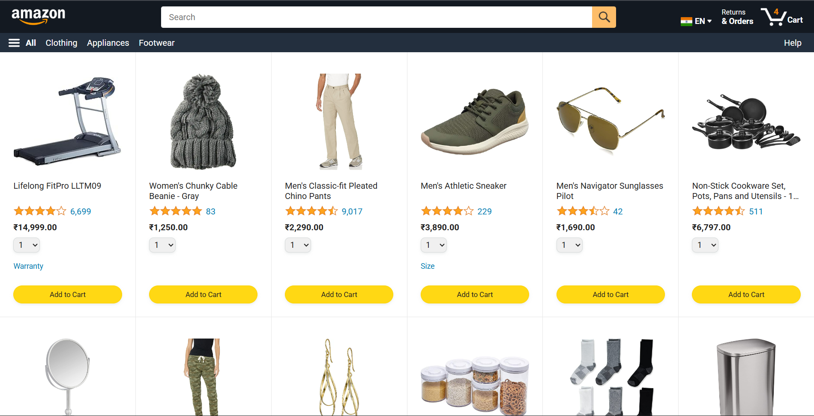

# 🌐 Riposis

Welcome to **Riposis.me** — my personal portfolio and project showcase.  
Here you’ll find my featured full-stack and frontend projects, built with **Spring Boot, React, Hibernate, and more**.

---

## 🚀 Featured Projects

### 🛒 Amazon Clone (Frontend Project)
A frontend clone of Amazon’s product listing page with cart functionality.  
- ⚛️ Built with **React + JavaScript**  
- 🌐 Integrated with external REST APIs  
- 🛍️ Features: product listing, search, cart, checkout flow  
- 🎨 Responsive design with Bootstrap  

🔗 **Live Demo:** [riposis.me/amazon](https://riposis.me/Amazon)  
📂 **Source Code:** [GitHub Repo](https://github.com/RIP0SIS/Amazon)

---

## 📸 Screenshots

| Amazon Clone (Frontend) |
|--------------------------|

---

## 🛠️ Tech Stack

- **Backend:** Spring Boot, Spring Security, JPA/Hibernate  
- **Frontend:** React, JavaScript, Bootstrap  
- **Database:** MySQL   
- **Testing:** Jasmine, Mockito  
- **Docs & Tools:** Swagger/OpenAPI, Git, VS Code, IntelliJ  

---

## 👨‍💻 About Me

I’m a **Full Stack Developer** passionate about building clean, scalable applications with **Java + Spring Boot** on the backend and **JS + React** on the frontend.  

📫 Reach me at: [Link](mailto:restinpeace869@gmail.com)  
📂 GitHub: [Link](https://github.com/RIP0SIS)
